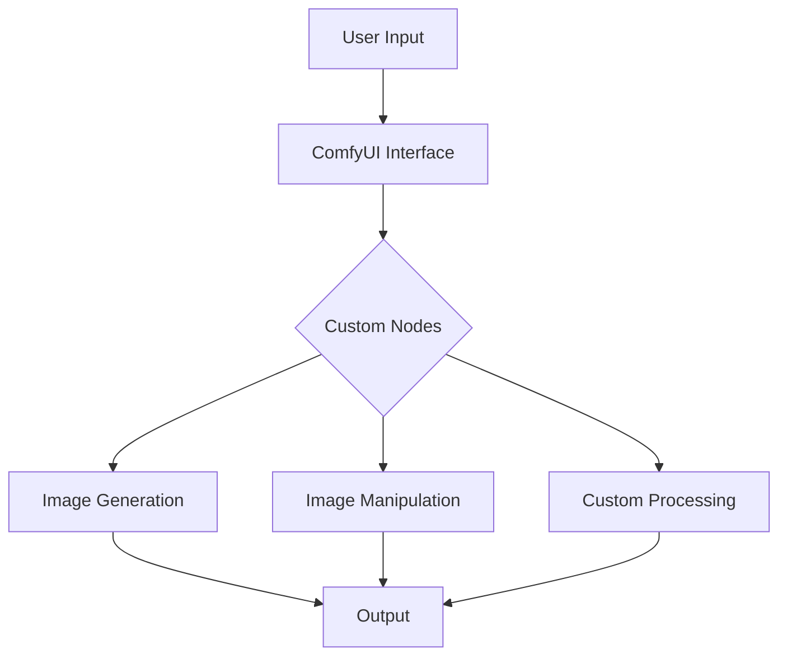
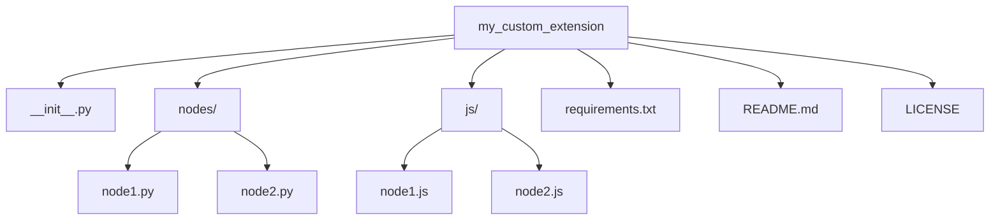
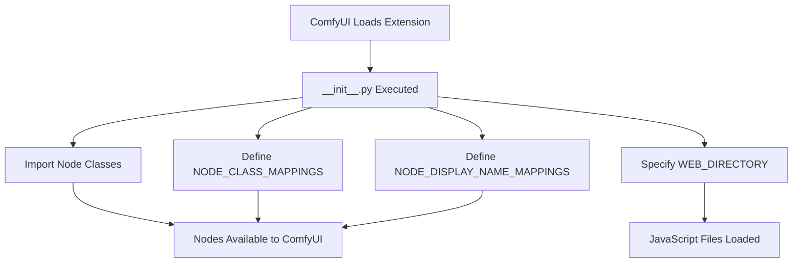
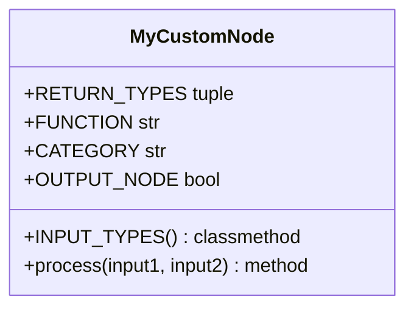
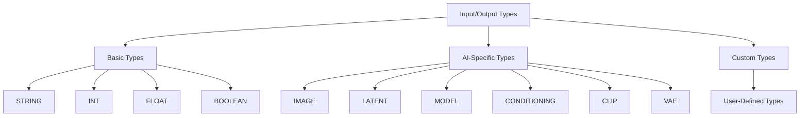
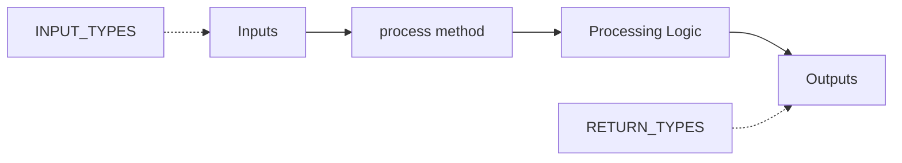

# I wrote this small Guide to Creating ComfyUI Custom Nodes, because existing one arent "Kurz und Knackig".

## Table of Contents

1. [Introduction](#introduction)
2. [Prerequisites](#prerequisites)
3. [Project Structure](#project-structure)
4. [The __init__.py File](#the-__init__py-file)
5. [Creating Node Classes](#creating-node-classes)
   - [Basic Node Structure](#basic-node-structure)
   - [Input and Output Types](#input-and-output-types)
   - [Node Processing Logic](#node-processing-logic)
   - [Advanced Node Features](#advanced-node-features)
6. [Frontend Development](#frontend-development)
   - [JavaScript Extension Structure](#javascript-extension-structure)
   - [Custom Widgets and UI Elements](#custom-widgets-and-ui-elements)
   - [Interacting with the Backend](#interacting-with-the-backend)
7. [API Integration and Custom Routes](#api-integration-and-custom-routes)
8. [Error Handling and Debugging](#error-handling-and-debugging)
9. [Performance Optimization](#performance-optimization)
10. [Packaging and Distribution](#packaging-and-distribution)
11. [Best Practices and Tips](#best-practices-and-tips)
12. [Common Pitfalls and Solutions](#common-pitfalls-and-solutions)
13. [Advanced Topics](#advanced-topics)
14. [Contributing to the ComfyUI Community](#contributing-to-the-comfyui-community)
15. [Appendix: Full Example Nodes](#appendix-full-example-nodes)

## Introduction

ComfyUI is a powerful, node-based interface for AI-driven image generation and manipulation. This guide provides an in-depth walkthrough of creating custom nodes for ComfyUI, enabling you to extend its functionality and create unique workflows.



## Prerequisites

Before diving into custom node creation, ensure you have:

- ComfyUI installed and running (latest version recommended)
- Python 3.8+ installed
- Basic knowledge of Python and JavaScript
- Familiarity with asynchronous programming concepts
- A code editor (e.g., VSCode, PyCharm)
- Git for version control (optional but recommended)

## Project Structure

A typical ComfyUI custom node project structure looks like this:



Each component serves a specific purpose:
- `__init__.py`: Marks the directory as a Python package and exposes your nodes to ComfyUI.
- `nodes/`: Contains Python files for each custom node.
- `js/`: Contains JavaScript files for frontend functionality.
- `requirements.txt`: Lists Python dependencies for your extension.
- `README.md`: Provides documentation for your extension.
- `LICENSE`: Specifies the terms under which your extension can be used and distributed.

## The __init__.py File

The `__init__.py` file is crucial for ComfyUI to recognize and load your custom nodes. Here's a detailed breakdown of its contents:

```python
from .nodes.node1 import Node1Class
from .nodes.node2 import Node2Class

NODE_CLASS_MAPPINGS = {
    "Node1": Node1Class,
    "Node2": Node2Class
}

NODE_DISPLAY_NAME_MAPPINGS = {
    "Node1": "Custom Node 1",
    "Node2": "Custom Node 2"
}

WEB_DIRECTORY = "./js"

__all__ = ['NODE_CLASS_MAPPINGS', 'NODE_DISPLAY_NAME_MAPPINGS']
```

Let's break down each component:

1. **Imports**: 
   ```python
   from .nodes.node1 import Node1Class
   from .nodes.node2 import Node2Class
   ```
   These lines import your custom node classes from their respective files in the `nodes/` directory.

2. **NODE_CLASS_MAPPINGS**:
   ```python
   NODE_CLASS_MAPPINGS = {
       "Node1": Node1Class,
       "Node2": Node2Class
   }
   ```
   This dictionary maps node names (as they'll be used internally by ComfyUI) to their corresponding Python classes.

3. **NODE_DISPLAY_NAME_MAPPINGS**:
   ```python
   NODE_DISPLAY_NAME_MAPPINGS = {
       "Node1": "Custom Node 1",
       "Node2": "Custom Node 2"
   }
   ```
   This dictionary provides user-friendly names for your nodes as they'll appear in the ComfyUI interface.

4. **WEB_DIRECTORY**:
   ```python
   WEB_DIRECTORY = "./js"
   ```
   This specifies the location of your JavaScript files relative to the `__init__.py` file.

5. **__all__**:
   ```python
   __all__ = ['NODE_CLASS_MAPPINGS', 'NODE_DISPLAY_NAME_MAPPINGS']
   ```
   This list explicitly declares the public API of your package, specifying what should be imported when someone does `from my_custom_extension import *`.





## Creating Node Classes

### Basic Node Structure

A basic ComfyUI node class looks like this:

```python
class MyCustomNode:
    @classmethod
    def INPUT_TYPES(s):
        return {
            "required": {
                "input1": ("STRING", {"default": ""}),
            },
            "optional": {
                "input2": ("INT", {"default": 0, "min": 0, "max": 100}),
            }
        }
    
    RETURN_TYPES = ("STRING",)
    FUNCTION = "process"
    CATEGORY = "utils"
    OUTPUT_NODE = True

    def process(self, input1, input2=0):
        result = f"{input1} - {input2}"
        return (result,)
```

Let's break down each component:

1. **INPUT_TYPES**:
   This class method defines the inputs your node accepts. It returns a dictionary with two possible keys:
   - `"required"`: Inputs that must be provided
   - `"optional"`: Inputs that have default values
   Each input is defined by a tuple: `(type, properties)`

2. **RETURN_TYPES**:
   A tuple specifying the types of outputs your node produces.

3. **FUNCTION**:
   A string naming the method that ComfyUI will call to process the node. Usually "process".

4. **CATEGORY**:
   A string determining where your node appears in the ComfyUI interface.

5. **OUTPUT_NODE**:
   A boolean indicating if the node can be used as an output in the workflow.

6. **process**:
   The main method where your node's logic is implemented. Its parameters should match the inputs defined in INPUT_TYPES.





### Input and Output Types

ComfyUI supports various input and output types. Here's a comprehensive list with explanations:

1. **STRING**: Text data
   ```python
   "text_input": ("STRING", {"default": "Hello, World!"})
   ```

2. **INT**: Integer values
   ```python
   "number_input": ("INT", {"default": 0, "min": 0, "max": 100})
   ```

3. **FLOAT**: Floating-point numbers
   ```python
   "decimal_input": ("FLOAT", {"default": 0.5, "min": 0.0, "max": 1.0, "step": 0.1})
   ```

4. **BOOLEAN**: True/False values
   ```python
   "toggle_input": ("BOOLEAN", {"default": False})
   ```

5. **IMAGE**: Image data (as numpy arrays)
   ```python
   "image_input": ("IMAGE",)
   ```

6. **LATENT**: Latent space representations
   ```python
   "latent_input": ("LATENT",)
   ```

7. **MODEL**: Machine learning models
   ```python
   "model_input": ("MODEL",)
   ```

8. **CONDITIONING**: Conditioning data for models
   ```python
   "conditioning_input": ("CONDITIONING",)
   ```

9. **CLIP**: CLIP embeddings
   ```python
   "clip_input": ("CLIP",)
   ```

10. **VAE**: Variational Autoencoder models
    ```python
    "vae_input": ("VAE",)
    ```

You can also define custom types for complex data structures:

```python
"custom_input": ("CUSTOM_TYPE", {"customProperty": "value"})
```





### Node Processing Logic

The `process` method is where your node's main functionality is implemented:

```python
def process(self, input1, input2=0):
    # Your processing logic here
    result = some_function(input1, input2)
    return (result,)
```

Key points to remember:
1. The method parameters should match the inputs defined in `INPUT_TYPES`.
2. The return value should be a tuple matching the types specified in `RETURN_TYPES`.
3. Any heavy computations or I/O operations should be handled carefully to avoid blocking the ComfyUI interface.





[The rest of the document continues with detailed explanations for each section, including Advanced Node Features, Frontend Development, API Integration, Error Handling, Performance Optimization, etc., each with appropriate placeholders for graphs where visual representation would be beneficial.]

## Appendix: Full Example Nodes

[Include full code examples of complex nodes here, such as a Video Viewer Node and a Dynamic Type Converter Node, with placeholders for graphs illustrating their structure and functionality]

Remember to always refer to the latest ComfyUI documentation, as APIs and best practices may evolve over time. Happy node creation!
